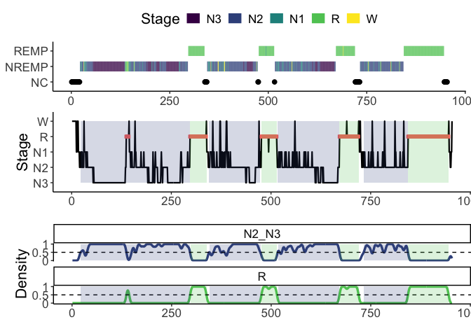

<!-- README.md is generated from README.Rmd. Please edit that file -->

# sleepcycles: Detect and Visualize Sleep Cycles from Hypnograms

<!-- badges: start -->
<!-- badges: end -->

**Analyze, Detect, and Visualize Sleep Cycles with Ease.**

The **sleepcycles** package provides tools for detecting, analyzing, and
visualizing **sleep cycles** from hypnogram data using **density-based
(DUDE) and rule-based (Feinberg) algorithms**. It supports both
**single-subject** and **grouped** datasets, enabling users to extract
and explore **Non-REM (NREMP) and REM (REMP) periods** with flexible
parameter settings. The package includes **interactive Shiny
applications**, a suite of **visualization functions** (e.g.,
hypnograms, density plots, and cycle summaries), and utilities for
**preprocessing and validating sleep staging data**.

📌 **Designed for sleep researchers, clinicians, and data scientists,
`sleepcycles` helps uncover the underlying dynamics of sleep
architecture and assess the impact of sleep patterns on health and
performance.**

------------------------------------------------------------------------

## **📦 Installation**

You can install the development version from GitHub using `{remotes}`:

``` r
# Install remotes if not installed
install.packages("remotes")

# Install sleepcycles from GitHub
remotes::install_github("yourusername/sleepcycles")
```

🚀 Quick Start Guide

1️⃣ Load the Package

``` r
library(sleepcycles)
```

2️⃣ Load Example Data

``` r
data("hypnogram_single", package = "sleepcycles")

# Preview the dataset
head(hypnogram_single)
#>   epoch stage
#> 1     1     W
#> 2     2     W
#> 3     3     W
#> 4     4     W
#> 5     5     W
#> 6     6     W
```

3️⃣ Detect Sleep Cycles

``` r
sleepcycles_obj <- sleepcycles_from_hypnogram(
  hypnogram_single, 
  epoch_col = "epoch", 
  stage_col = "stage", 
  method = "dude"
)
#> Warning: NREMP and REMP overlap (297-297). Splitting NREMP and keeping REMP...
#> Warning: NREMP and REMP overlap (672-672). Splitting NREMP and keeping REMP...
#> Warning: NREMP and REMP overlap (844-844). Splitting NREMP and keeping REMP...
#> Warning: NREMP and REMP overlap (297-338). Splitting NREMP and keeping REMP...
#> Warning: NREMP and REMP overlap (476-515). Splitting NREMP and keeping REMP...
#> Warning: NREMP and REMP overlap (672-720). Splitting NREMP and keeping REMP...
#> Warning: NREMP and REMP overlap (844-946). Splitting NREMP and keeping REMP...
```

4️⃣ Visualize Sleep Cycles

``` r
plot_summary(sleepcycles_obj)
```



5️⃣ Run the Interactive Shiny App

``` r
if (interactive()) {
  run_sleepcycles_app(sleepcycles_obj)
}
```

📊 Features ✔ Sleep Cycle Detection: Supports DUDE (Density-Based) and
Feinberg (Rule-Based) algorithms ✔ Interactive Visualization: Generate
hypnograms, density plots, and cycle summaries ✔ Shiny App: Modify and
explore cycle detection parameters interactively ✔ Preprocessing &
Validation: Built-in data validation tools ✔ Single and Grouped Data
Support: Works with individual and multi-subject datasets

📖 Available Functions

| **Function**                   | **Description**                                         |
|--------------------------------|---------------------------------------------------------|
| `sleepcycles_from_hypnogram()` | Detects sleep cycles using DUDE or Feinberg             |
| `plot_hypnogram()`             | Generates a hypnogram plot                              |
| `plot_densities()`             | Plots sleep cycle density curves                        |
| `plot_cycles()`                | Visualizes detected sleep cycles                        |
| `plot_summary()`               | Provides a combined visualization of sleep cycles       |
| `run_sleepcycles_app()`        | Launches an interactive Shiny app for cycle exploration |
| `check_hypnogram()`            | Validates hypnogram data for errors                     |

📚 Example Datasets The package includes two example datasets:

| **Dataset**         | **Description**                                 |
|---------------------|-------------------------------------------------|
| `hypnogram_single`  | Example hypnogram data for a single individual  |
| `hypnogram_grouped` | Example hypnogram data for multiple individuals |

``` r
data("hypnogram_single", package = "sleepcycles")
data("hypnogram_grouped", package = "sleepcycles")
```

📌 Contributing We welcome contributions! If you find a bug, please
[open an issue](https://github.com/JasonDude16/sleepcycles/issues).

📜 License This package is licensed under the MIT License.

📞 Contact 📧 Jason Dude 🔗
\[GitHub\]\[<https://github.com/JasonDude16>\] 🐦 Your Twitter Handle
